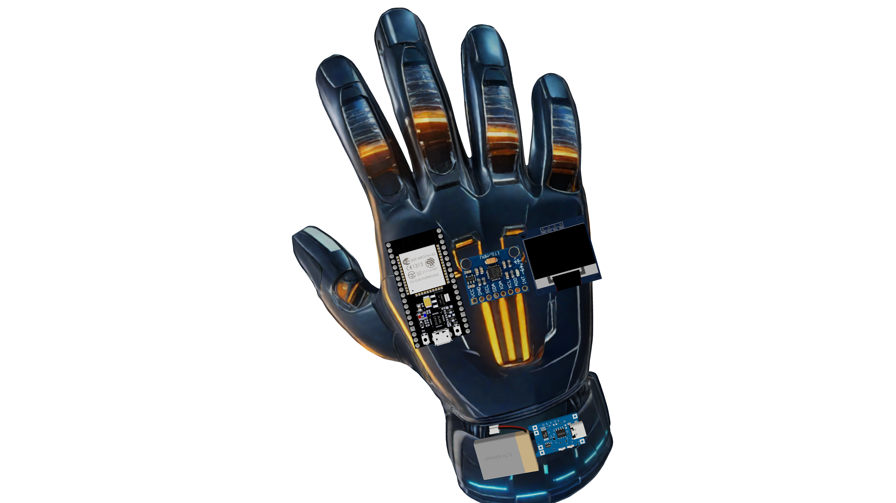

#  Air Glove – A Wireless Gesture & Click Control Interface



## Overview

**Air Glove** is an innovative wireless glove system designed to revolutionize human-computer interaction by replacing traditional pointing devices with intuitive gesture-based control. Leveraging gyroscopic sensing and touch input, the glove captures hand movement and click actions and transmits them wirelessly to a computer via Bluetooth.

The glove features:
- **MPU6050 Gyroscope/Accelerometer** for capturing motion.
- **Touch-sensitive inputs** for left and right click.
- **OLED Display** for on-device feedback.
- **Bluetooth Low Energy (BLE)** for wireless communication.
- **Laser pointer toggle** and multi-mode user interface.
- **Battery percentage monitoring** for power awareness.

This glove is ideal for advanced **gaming**, **gesture-based navigation**, **virtual reality**, and **presentation control** scenarios.

## ✨ Features

- **Wireless BLE Communication** (via `BleMouse`)
- **Cursor Movement** mapped from gyroscopic data
- **Touch-Based Clicks** (left/right click)
- **Laser Control**
- **MPU6050 Initialization & Calibration**
- **OLED Display UI** with welcome screens, mode selection, smiley animation
- **Power Monitoring** with visual battery indication

---

## 📦 Included Files

### `AirGlove.h` & `AirGlove.cpp` (Custom Library)

These files define the custom `AirGlove` class that encapsulates all glove functionality.

#### Key Methods
- `AirGlove_init()` - Initializes BLE, MPU6050, OLED, and GPIOs.
- `calibrateMPU()` - Calibrates the gyroscope for accurate movement.
- `moveCursor()` - Moves the mouse cursor based on gyro input.
- `leftClick()`, `rightClick()` - Simulates mouse clicks.
- `controlLaser()` - Toggles laser pointer with touch.
- `readBatteryPercentage()` - Reads analog voltage and estimates charge level.
- `displayWelcomeSequence()` - Animated startup screen with skip options.
- `displayModeSelection()` - UI to select glove operating mode.
- `handleSelection()` and `handleButtonPress()` - Menu navigation.
- `drawBatteryStatus()` - Draws battery icon on the OLED.

These are bundled to simplify the integration of movement control, UI rendering, and BLE interactions into your application code.

---

## 📋 Prerequisite Libraries

The following libraries must be installed in your Arduino environment:

- [`Wire.h`](https://www.arduino.cc/en/Reference/Wire) – I2C communication
- [`MPU6050`](https://github.com/jrowberg/i2cdevlib) – Motion sensing
- [`BleMouse`](https://github.com/T-vK/ESP32-BLE-Mouse) – BLE mouse emulation
- [`Adafruit GFX`](https://github.com/adafruit/Adafruit-GFX-Library) – Graphics core
- [`Adafruit SSD1306`](https://github.com/adafruit/Adafruit_SSD1306) – OLED display driver
- [`Kalman`](https://github.com/TKJElectronics/KalmanFilter) – Sensor filtering (optional but initialized)

Ensure all dependencies are installed via the Arduino Library Manager or as ZIP imports.

---

## 🧪 Sample Usage

Check out the sample sketch provided in `AirGlove.ino` for how to instantiate and use the `AirGlove` class:

```cpp
#include "AirGlove.h"

AirGlove glove(2, T0, T3, 13, T4, T5, T6);

void setup() {
  glove.AirGlove_init();
  glove.calibrateMPU();
}

void loop() {
  glove.checkConnection();
  glove.readBatteryPercentage();
  glove.moveCursor();
  glove.leftClick();
  glove.rightClick();
  glove.controlLaser();
  glove.handleButtonPress();
  glove.handleSelection();
}
```


## 🚀 Future Scope

Air Glove is a platform with immense potential:
- Enhanced **gesture navigation** with additional DOF sensing.
- Seamless integration into **VR/AR** environments.
- Expansion into **gaming** as a motion controller.
- **Custom modes** and app integrations (e.g., music control, smart TV navigation).


## 🙌 Contributions

Feel free to open issues or PRs for improvements, ideas, or documentation enhancements.
